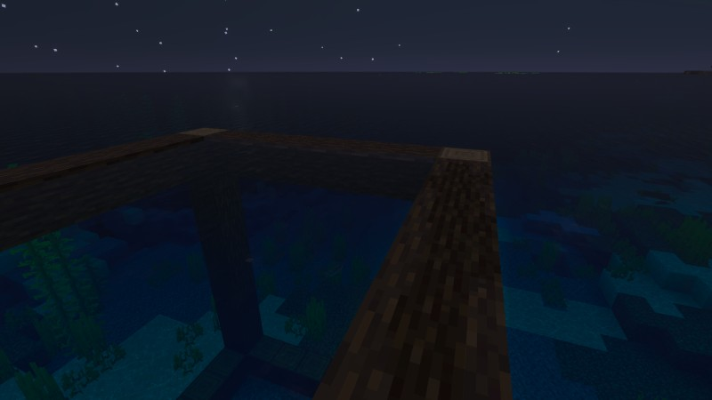

# Mareatesta
A vessel for the mind, anchored to the tides of time.

> Project name, description and this readMe are unrelated to the repository content.

## The Tide and the Vessel
*Mareatesta* represents a state of mind experiencing the recurring cycles of time.
It describes the consciousness as a vessel anchored amidst the shifting tides of existence.

The term is a synthesis of two distinct references that bridge ancient philosophy with modern global infrastructure:

- **Marea (the Tide)**: Beyond its literal meaning, this references the MAREA subsea cable, a massive fiber optic line bridging the Atlantic.
  It serves as a metaphor for the vast, rhythmic nature of global connection and the fluid movement of time.
- **Testa (the Vessel)**: This draws from the ancient Latin root for an earthen vessel or shell, which evolved into the modern word for the head.
  It signifies the mind as a casing for the ego - a vessel that carries the essence of the self through the currents of experience.